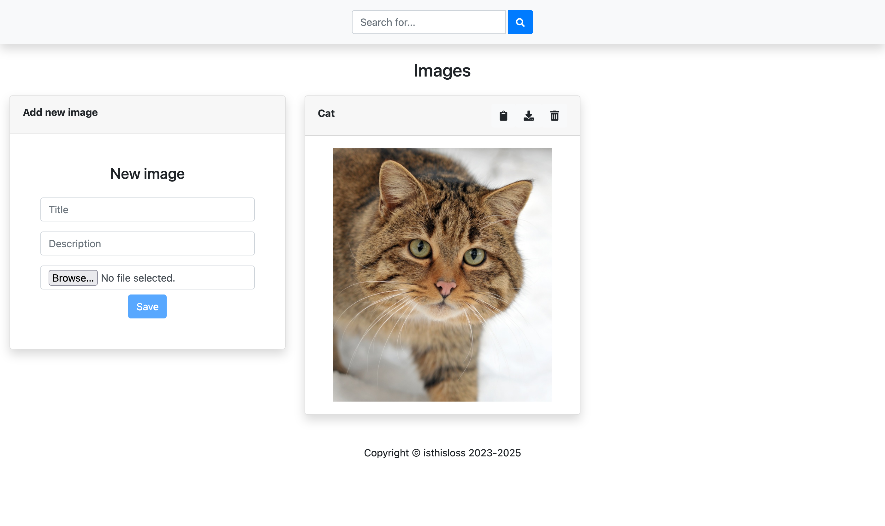

# ImageSearch

Pet project to test FastAPI web fremework

## About

Simple web application. It provides http api and web ui to upload url to image, title and description. After uploading server tries to detect text on image. Finally it stop that data in mongo db, which allows to perform full text search.

## Todo
- Add edit option.
- Detect image text in async queue.
- Make authorization.

## Run
The simplest way is to use docker compose:
```
  sudo docker-compose build
  sudo docker-compose up
```
Details:
Backend is a python application.
One can manually build python package from setup.py, see commands sequence in backend/Dockerfile

Frontend is a vuejs + typescript + bootstrap application.

## Development

### Frontend
To run dev environment use default vuejs flow
```
  yarn install
  yarn run serve
```

### Backend
Install python and pip
```
  apt update && apt install -y python3 python3-pip
```
Create virtualenv
```
  python3 -m pip install virtualenv
  python3 -m virtualenv ./venv
  source ./venv/bin/activate  
```
Install dependencies
```
  pip install -r requirements.txt
```
Create .env file with settings, it is required to provide MONGODB_LOGIN, MONGODB_PASSWORD environment variables
Also, one can start mongodb in docker container usig backend/dev/docker-compose.yaml
It contains the same configuration of mongodb as main docker-compose.yaml in project's root, but use network_mode: host
Run
```
  uvicorn image_search:app
```

## Preview

